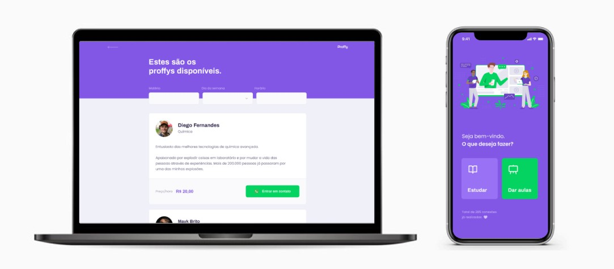

<h1 align="center">
    
</h1>

<h1 align="center">
    
</h1>

## 📝 Projeto
Proffy é uma plataforma online que conecta estudantes e professores. É possível se cadastrar para oferecer aulas ou procurar professores das matérias que você quer aprender.

Este projeto foi desenvolvido durante a NLW#2 - Next Level Week #2, trilha Omnistack, oferecida pela Rocketseat.

## 💻 Tecnologias
- Node.js
- React
- React Native
- TypeScript
- Expo
- Express
- SQLite

## 🎨 Layout
O layout da aplicação está disponível no Figma: [Web](https://www.figma.com/file/GHGS126t7WYjnPZdRKChJF/Proffy-Web) e [Mobile](https://www.figma.com/file/e33KvgUpFdunXxJjHnK7CG/Proffy-Mobile?node-id=0%3A1).

## 🤔 Como contribuir

- Faça um fork desse repositório;
- Crie uma branch com as suas alterações: `git checkout -b my-feature`;
- Commit suas alterações: `git commit -m 'feat: my new feature'`;
- Faça um push para a sua branch: `git push origin my-feature`.

## 📜 Licença

> Este projeto está sob a licença MIT. Veja o arquivo [LICENSE](https://github.com/jessicafpx/nextlevelweek-omnistack-proffy/blob/master/LICENSE.md) para mais detalhes.

---

##### 
 <strong> < desenvolvido por <a href="github.com/jessicafpx"> @jessicafpx</a> /> </strong> 👋